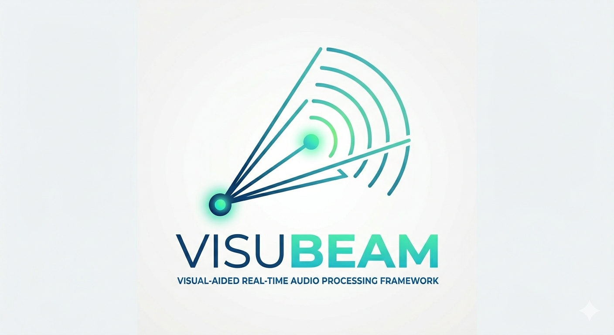
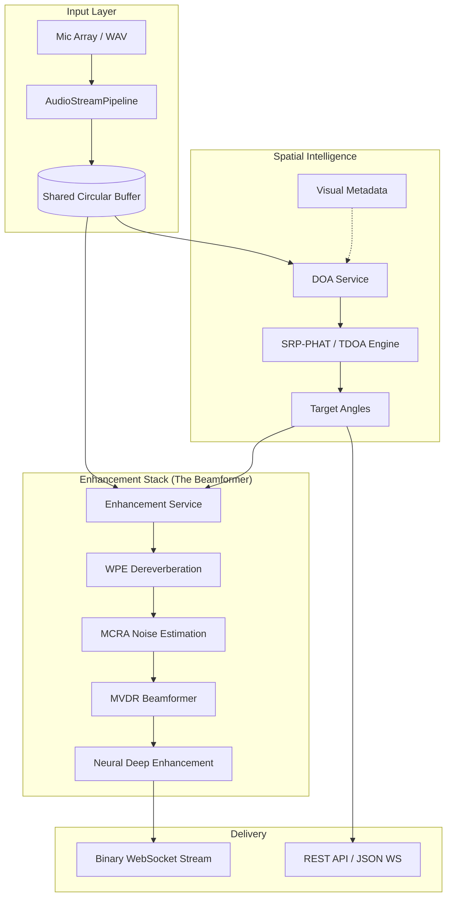

# VisuBeam



**VisuBeam** is a high-performance, real-time audio processing framework designed for multi-channel microphone arrays. By leveraging **visual-aided guidance**, it achieves state-of-the-art precision in sound source localization (DOA) and speech enhancement.

The system bridges the gap between raw multi-channel audio capture and crystal-clear target voice extraction, making it ideal for smart conferencing, robotics, and advanced human-computer interaction.

---

## 🌟 Overview

VisuBeam is more than just an audio processor; it is a cross-modal fusion engine. While traditional audio systems struggle with the "Cocktail Party Problem," VisuBeam uses visual coordinates to "look" at the target speaker, allowing the underlying **MVDR Beamformer** to precisely suppress spatial interference and background noise.

### Core Pipeline
1.  **Visual-Aided DOA**: Uses external visual tracking data to guide the SRP-PHAT/TDOA localization.
2.  **Spatial Filtering**: Employs Minimum Variance Distortionless Response (MVDR) to create a focused "beam" toward the speaker.
3.  **Noise Estimation**: Uses Minima Controlled Recursive Averaging (MCRA) for dynamic environment adaptation.
4.  **Signal Conditioning**: Integrated WebRTC Audio Processing Module (APM) for echo cancellation and stationary noise reduction.
5.  **Neural Enhancement**: Optional DTLN (Dual-Path RNN) models for extreme noise suppression.

---

## 🛠️ Installation

### 1. System Dependencies (Ubuntu/Debian)
Install essential build tools and libraries:
```bash
sudo apt update
sudo apt install -y build-essential swig python3-dev libssl-dev zlib1g-dev \
libbz2-dev libreadline-dev libsqlite3-dev wget curl llvm \
libncursesw5-dev xz-utils tk-dev libxml2-dev libxmlsec1-dev libffi-dev liblzma-dev
```

#### PortAudio Setup
Using `aptitude` is recommended to resolve complex dependencies for `portaudio19-dev`:
```bash
sudo apt install aptitude
sudo aptitude install portaudio19-dev 
```
> **Note**: When prompted to remove `libjack`, select **Yes**. If prompted to keep `libsound2-dev`, select **No** and then **y** to allow downgrading for compatibility.

### 2. Python Environment

#### Option A: Using pyenv (Recommended)
```bash
curl https://pyenv.run | bash
# Add to ~/.profile or ~/.bashrc
export PYENV_ROOT="$HOME/.pyenv"
[[ -d $PYENV_ROOT/bin ]] && export PATH="$PYENV_ROOT/bin:$PATH"
eval "$(pyenv init - bash)"

# Restart terminal, then install Python 3.11
pyenv install 3.11
pyenv global 3.11
```

#### Option B: Using Conda
```bash
conda create -n visubeam python=3.11 -y
conda activate visubeam
```

### 3. Python Dependencies
Install requirements using official or mirror indexes:
```bash
# Core dependencies
pip install -r requirements.txt -i https://mirrors.aliyun.com/pypi/simple/

# PyTorch (for DTLN/Neural modules)
pip install -r requirements-pytorch.txt --index-url https://download.pytorch.org/whl/cu121
```

### 4. Verify Installation
```bash
python -c "from webrtc_audio_processing import AP; print('WebRTC APM installed successfully')"
```

---

## 🚀 Usage

### Running the Service

#### Live Audio Processing Mode
Starts the real-time server listening for network requests and audio streams.
```bash
python main.py run --host 0.0.0.0 --port 8000
```

#### File Processing Mode
Process a pre-recorded multi-channel WAV file.
```bash
python main.py run --audio-file /path/to/array_audio.wav
```

### Command Line Interface (CLI)

- **`run`**: Main execution command.
  - `--config`: Path to `config.yaml` (Default: config.yaml)
  - `--audio-file`: Path to audio file for offline mode.
  - `--host`/`--port`: Network configuration for service mode.
- **`status`**: Check system health and runtime metrics.
- **`config`**: 
  - `list-devices`: List available microphone arrays/audio interfaces.
  - `validate`: Check your YAML configuration for errors.
- **`monitor`**: Real-time dashboard for CPU/Memory and Audio Buffer health.
- **`stop`**: Gracefully terminate running background services.

---

## 📡 API Documentation

### REST API (Control Plane)

#### **Update Tracking Info**
- **Endpoint**: `POST /api/v1/tracking/update`
- **Payload**: List of `TrackingItem`
  ```json
  [ { "id": 101, "angle": 45.5 } ]
  ```
- **Description**: Updates the target angle for a specific person ID. Triggers the MVDR beamformer to point at the new angle.

#### **Target Leave**
- **Endpoint**: `POST /api/v1/tracking/leave`
- **Payload**: `{ "id": 101 }`
- **Description**: Notifies the system that the target has left; releases processing resources.

### WebSocket (Data Plane)

#### **1. Real-time Angles**
- **URL**: `ws://<host>:8000/ws/tracking/angles`
- **Output**: JSON stream of detected sound sources and their energy levels.

#### **2. Enhanced Audio Stream**
- **URL**: `ws://<host>:8000/ws/audio/enhanced/{person_id}`
- **Protocol**: Binary Hybrid Protocol
  - **Structure**: `[Header Length (4B, Big Endian)] [JSON Header] [Raw PCM Bytes]`
  - **PCM Format**: 16-bit Signed, 16kHz, Mono.

---

## 🏗️ System Architecture & Engineering

VisuBeam is engineered for low-latency, high-concurrency audio processing. It employs a decoupled architecture to ensure that heavy DSP computations do not block real-time audio capture.

### 1. The Core: Shared Circular Buffer (Producer-Consumer)
At the heart of VisuBeam is a thread-safe **Shared Circular Buffer**. This architecture decouples the **Audio Producer** (Microphone/File Stream) from the **DSP Consumers** (DOA & Enhancement).

*   **Zero-Drop Capture**: High-priority threads handle audio I/O to prevent buffer overflows.
*   **Multi-Consumer Fan-out**: A single audio stream can be consumed by the DOA engine and multiple independent enhancement instances (e.g., tracking different people) simultaneously.

### 2. Processing Pipeline
The system processes audio in a sophisticated multi-stage pipeline:



### 3. Algorithm Deep-Dive
*   **WPE (Weighted Prediction Error)**: Removes late reverberation to improve speech intelligibility in echoic rooms using the NARA-WPE algorithm.
*   **MVDR (Minimum Variance Distortionless Response)**: A spatial filter that preserves the signal from the target direction while minimizing total output variance (interference).
*   **MCRA (Minima Controlled Recursive Averaging)**: Robustly tracks non-stationary noise floors to provide accurate noise statistics for the beamformer.
*   **DTLN (Dual-Path RNN)**: A state-of-the-art neural network that operates in both time and frequency domains for non-linear noise suppression.

### 4. High-Concurrency Resource Management
To support multiple concurrent users/streams, VisuBeam implements:
*   **DTLN Model Pooling**: Pre-loaded model instances managed by a `ModelLoader` to avoid initialization latency during active sessions and ensure state isolation.
*   **Async Networking**: FastAPI-based WebSocket handlers that ensure audio delivery doesn't bottleneck the DSP pipeline.
*   **Binary Hybrid Protocol**: A custom streaming format that prepends JSON metadata (containing frame-level energy and angles) to raw PCM bytes, optimized for real-time web clients.


---

## 📝 Deployment (Linux Systemd)

A template `doa.service` is provided for production environments.

1.  Edit `doa.service` to match your local paths and user.
2.  Deploy to systemd:
    ```bash
    sudo cp doa.service /etc/systemd/system/visubeam.service
    sudo systemctl daemon-reload
    sudo systemctl enable visubeam
    sudo systemctl start visubeam
    ```

---

## 📜 License
This project is licensed under the MIT License - see the [LICENSE](LICENSE) file for details.
